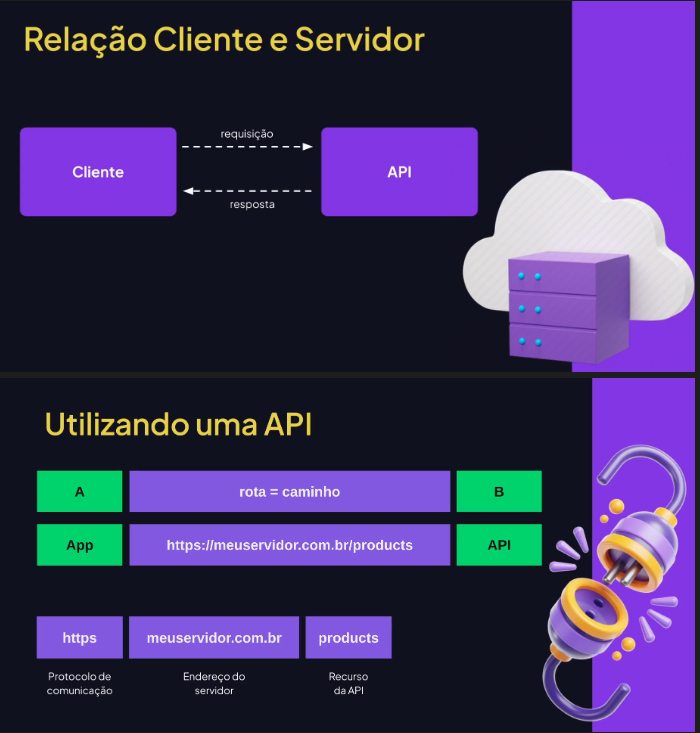
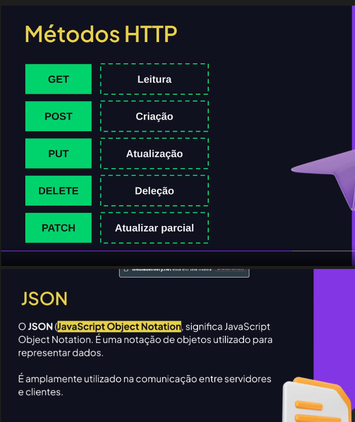
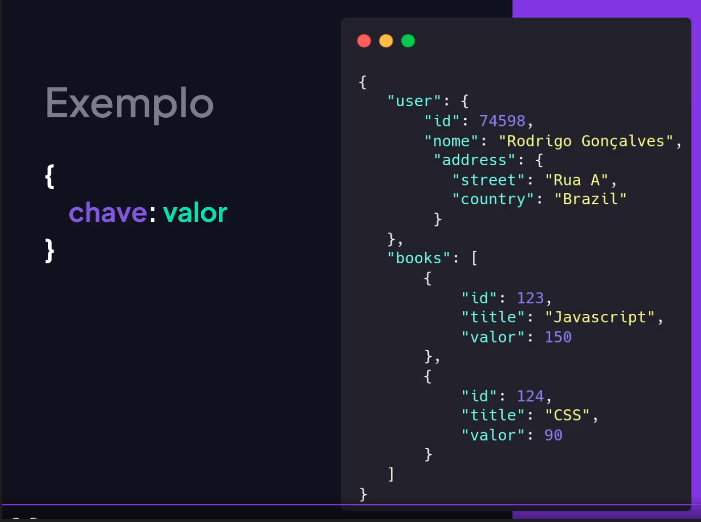
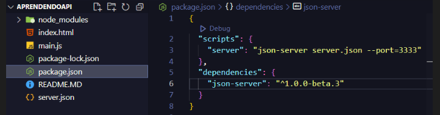

# API (Application Programming Interface)
Interface que disponibiliza um conjunto de funcionalidades para serem utilizadas
Ex: API de CEP, previsao de temo, cotacao de moedas, etc.'
Podem ser de graca ou paga




## JSON SERVER
- Para baixar, utiliza-se o comando  `npm install json-server`
- Para rodar utiliza-se `npm run server`


Sendo que deve haver um script de server para rodar
## Instalar versoes especificas de pacote
utiliza-se @ para baixar

## Instalar versoes especificas de pacote
utiliza-se @ para baixar
```
install json-server@1.0.0-alpha.17
```
## Utilizando fetch para ler API
- Inserir o link do local que precisa trabalhar os dados com fetch
- tratar com then trasnformando para JSON
- Fazer a leitura dos dados