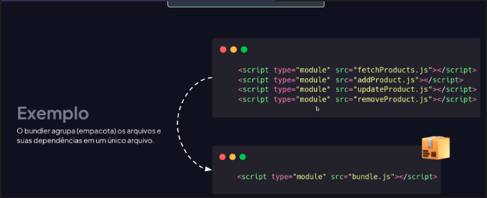
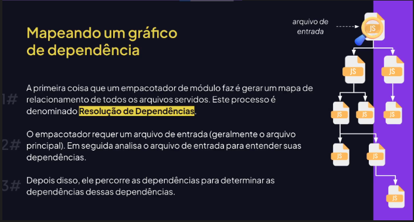
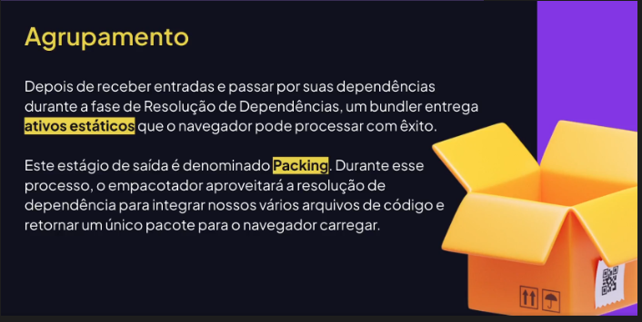
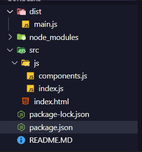
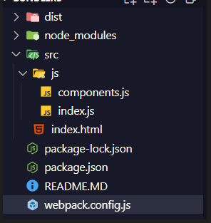
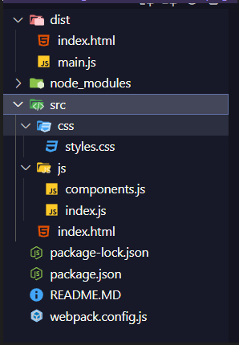

# Bundlers
Agrua (empacota) diversos arquivos e suas dependencias em um ou mais pacotes com o objetivo de otimizar o carregamento de paginas web


## Funcionamento
Geracao do grafico de dependencia e empacotamento



### Agrupamento
depois de passar pelas dependencias vai para e etapa de agrupamento


### Para baixar o empacotador
Utiliza-se o webpack
```
npm install webpack webpack-cli --save-dev
```
- Apos usar esse comando no console
- Criar o script que roda o index.js (arquivo que puxamos a exportacao de outro, arquivo "final") -- Isso no arquivo package.json
```
{

  "scripts": {

    "build": "webpack ./src/js/index.js"

  },

  "devDependencies": {

    "webpack": "^5.97.1",

    "webpack-cli": "^6.0.1"

  }

}
```
- Ao rodar, esses dois arquivos que estavam na pasta src de JS vao se tornar apenas um 


- Junto com a criacao da pasta dist e surgira um arquivo "main.js"

## Configurando webpack
- Criar um arquivo com o nome "webpack.config.js"



- No qual passamos o "path" para aceitar em todos os SO
```
const path = require("path")

  

module.exports = {

    entry: path.resolve(__dirname, "src", "js", "index.js"),

    output: {

        filename: "main.js",

        path: path.resolve(__dirname, "dist")

    },

    mode: "development"

}
```
### Como incluir o HTML
- Baixar primeiro o plugin
```
npm install --save-dev html-webpack-plugin
```
- Depois, incluir no arquivo de configuracao do webpack, incluindo o plugin com plugins: [nome do plugin] e criacao de uma constante com o uso de "require" do Node
```
const path = require("path")

const HTMLWebPackPlugin = require("html-webpack-plugin")

module.exports = {

    entry: path.resolve(__dirname, "src", "js", "index.js"),

    output: {

        filename: "main.js",

        path: path.resolve(__dirname, "dist")

    },

    mode: "development",

    plugins: [new HTMLWebPackPlugin()]

}
```
### Incluindo o css
- Depois de criar uma pasta de CSS dentro de src


- No arquivo de index, podemos importar o arquivo do css usando 
```
import "../css/styles.css"
```
- Apos isso, criamos uma configuracao no arquivo de configuracao do webpack
```
    module: {

        rules: [{

            test: /\.css$/i,

            use: ["style-loader", "css-loader"],

            exclude: "./node_modules",

        }]

    }

}
```
- Incluindo module, rules, e o "use" que sao os plugins utilizados
- apos isso, baixa-se esses plugins com o comando
```
npm install style-loader css-loader --save-dev
```
### Incluindo o babel
- Ir na documentacao do webpack de babel
- Pode copiar a regra de css, mudando a pasta para aquela que tem JS, coloca as configs que tem no site e seja feliz
```
{

                test: /\.js$/i,

                exclude: "/node_modules",

                use: {

                    loader: "babel-loader",

                    options: {

                        presets: [["@babel/preset-env", {targets: "defaults" }]],

                    }

                }

            }
```

- Execute no console
```
npm install @babel/core @babel/preset-env babel-loader --save-dev
```
apos isso execute a build novamente
```
npm run build
```
### Webpack dev server
- Simula um servidor interno
- Instalar pelo comando
```
npm install --save-dev webpack webpack-dev-server
```
### Configurando
- Criacao de um "mode"
- depois criar o "devServer" colocando o diretorio, port e abertura true pra quando executar abrir uma aba nova, parecido com a extensao do live server
```
    mode: "development",

    devServer: {

        static: {

            directory: path.join(__dirname, "dist", "index.html"),

        },

        port:3000,

        open: true,

    },
```
- Ai precisa executar 
```
npm run dev
```

