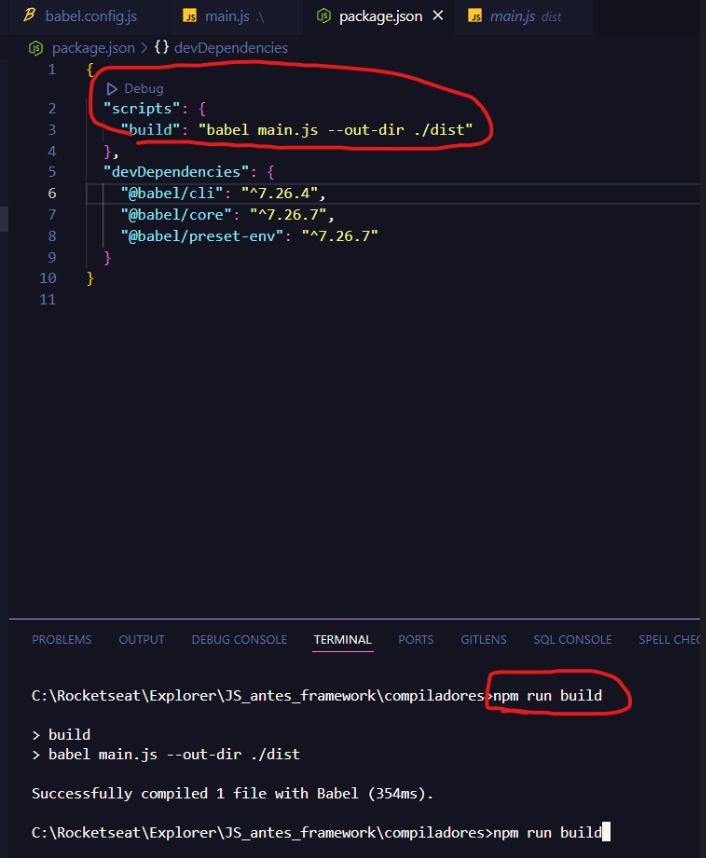

# Lembrar de executar
```
npm install
```
- para baixar os node_modules

# Compiladores
Converte o codigo escrito em uma versao para outra versao, permitindo usar recursos mais recentes da linguagem, memo em ambientes que nao oferecem suporte a essas funcionalidades
## Transpilacao


## Instalando Compilador JS
```
npm install --save-dev @babel/core @babel/cli @babel/preset-env
```
- save dev = esses pacotes sao dependencias de desenvolvimento

- Pacote Node e 2 arquivos JSON sao gerados
- A pasta vai ter os pacotes
- Recomendado de quando for subir, excluir e dps no console dar 
```
npm install
```
### Configurando e utilizando o babel
- Criar um arquivo com o nome: babel.config.js


- Para executar o babel executamos pelo terminal, no windows a barra e  ao contraria
```
.\node_modules.\.bin\babel main.js --out-dir dist
```
vai criar uma nova pasta
Para atualizar o arquivo, basta reenviar o comando novamente

### Criando um script para compilar


- Para evitar ficar colocando o comando, podemos executar ele em um script no arquivo de package.json e depois colocar o comando com o nome atribuido "build"
```
npm run build
```
### Utilizando arquivo compilado
Pode ser passado o codigo compilado para usar no arquivo de script, porem ao atualizar o arquivo "main", precisa sempre executar o comando 
```
npm run build
```
Para atualizar o arquivo compilado tbm
### Automatizando as mudancas
- Para isso, podemos passar o comando de Watch para sempre que o arquivo for atualizando, ja atualize o arquivo compilado
```
{

  "scripts": {

    "build": "babel main.js --watch --out-dir ./dist"

  },

  "devDependencies": {

    "@babel/cli": "^7.26.4",

    "@babel/core": "^7.26.7",

    "@babel/preset-env": "^7.26.7"

  }

}
```
- Apos isso, basta executar
```
npm run build
```
 e ficara em "watch " para cada atualizacao
### Configurando targets
Basicamente definimos qual versao vamos suportar do navegador
Na pasta de babel.config.js
```
const presets = [

    [

        "@babel/preset-env",

        {

            targets: {

                edge: "17",

                firefox: "60",

                chrome: "67",

                safari: "11.1"

            }

        }

    ]

]

  

module.exports = {presets}
```
### Extra
Criar um pacote que executamos o script de "build" (executar sem ficar em watch) e um pacote com "dev" no package.json
```
{

  "scripts": {

    "build": "babel main.js --out-dir ./dist",

    "dev": "babel main.js --watch --out-dir ./dist"

  },

  "devDependencies": {

    "@babel/cli": "^7.26.4",

    "@babel/core": "^7.26.7",

    "@babel/preset-env": "^7.26.7"

  }

}
```