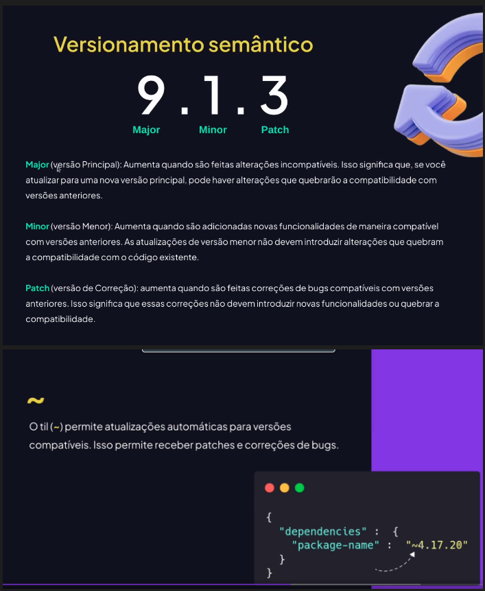

# Pacotes ou Blibliotecas
Fornecem funcionalidades prontas
Acelera o desenvolvimento
Feito pela propria comunidade
## day.js ()
Exemplo de utilizacao de pacote
## Gerenciador de pacotes
Ferramenta que facilita a instalacao, atualizacao e gerenciamento de bilbliotecas e dependencias de um projeto
### NPM (Node Package Manager)
Gerenciador de pacotes de JS mais famoso
### Dependendecians e ambientes
##### Producao
Inclui as dependencias (pacotes/blibliotecas) necessarias para a execucao do projeto em um ambiente de producao - para os usuarios
##### Desenvolvimento
Pacotes / ferramentas que utilizamos para produzir a aplicacao
## Resolucao de dependencias
### Versionamento semantico
Padrao de atualizacoes de versoes que oferece um modelo facil de entender o que mudou de uma versao

